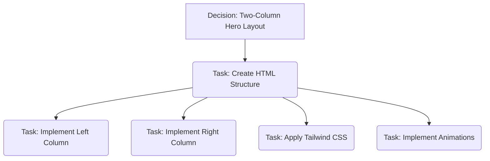

# Home Page Implementation Plan

## Plan Summary

The plan is to build the hero section using a two-column layout, as this directly reflects the provided design. The left column will contain the main heading and the "Free sign up" button, while the right column will feature the detailed illustration. All styling will be implemented using Tailwind CSS, and animations will be added to match the dynamic feel of the design.

## Plan Visualization

## Detailed Task List

1.  **Structured the hero section HTML with a two-column layout.** (Completed)
2.  **Implemented the left column content:** headings and 'Free sign up' button. (Completed)
3.  **Implemented the right column illustration with all its visual elements.** (Completed)
4.  **Applied Tailwind CSS classes to match the design, translating styles from the Framer HTML.** (Completed)
5.  **Implemented mouse-over animations for interactive elements in the hero section.** (Completed)