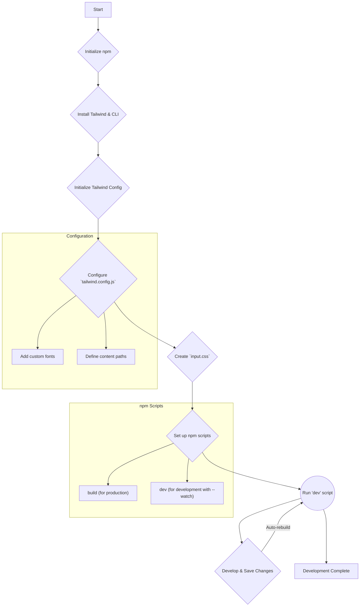

# Project Plan: Static Site with Tailwind CSS

This document outlines the plan for setting up and using Tailwind CSS for the TinyGnomes static website project. This approach uses the modern Tailwind CLI, which is ideal for development and provides an optimized production build.

## 1. Project Setup & Tailwind Configuration

This phase focuses on initializing the project and configuring Tailwind CSS.



### Step-by-Step Instructions:

1.  **Initialize npm**:
    Create a `package.json` file to manage project dependencies.
    ```bash
    npm init -y
    ```

2.  **Install Tailwind CSS**:
    Install the latest versions of `tailwindcss` and `@tailwindcss/cli` as development dependencies.
    ```bash
    npm install -D tailwindcss@latest @tailwindcss/cli@latest
    ```

3.  **Initialize Tailwind CSS**:
    Generate the `tailwind.config.js` file. This command uses the new CLI package.
    ```bash
    npx @tailwindcss/cli init
    ```

4.  **Configure `tailwind.config.js`**:
    Update the generated config file to include paths to your HTML files and to add the custom fonts required by the project.

    ```javascript
    /** @type {import('tailwindcss').Config} */
    module.exports = {
      content: [
        "./website/**/*.html",
        "./website/**/*.js",
      ],
      theme: {
        extend: {
          fontFamily: {
            inter: ['Inter', 'sans-serif'],
            raleway: ['Raleway', 'sans-serif'],
            'fragment-mono': ['Fragment Mono', 'monospace'],
            rancho: ['Rancho', 'cursive'],
          },
        },
      },
      plugins: [],
    }
    ```

5.  **Create CSS Entrypoint**:
    Create a main CSS file at `website/src/input.css` and add the `@import` directive for Tailwind.
    ```css
    /* website/src/input.css */
    @import "tailwindcss";
    ```

6.  **Set Up npm Scripts**:
    Add `dev` and `build` scripts to your `package.json` for an efficient workflow.

    ```json
    "scripts": {
      "dev": "npx @tailwindcss/cli -i ./website/src/input.css -o ./website/dist/output.css --watch",
      "build": "npx @tailwindcss/cli -i ./website/src/input.css -o ./website/dist/output.css --minify"
    }
    ```

## 2. Development Workflow

To start developing, run the `dev` script in your terminal:

```bash
npm run dev
```

This command will:
-   Compile your CSS into `website/dist/output.css`.
-   **Watch** for any changes in your HTML and CSS files.
-   **Automatically rebuild** the CSS whenever you save a file, ensuring your changes are reflected instantly.

## 3. Header Implementation

With the setup complete, you can proceed to build the header:

1.  **Create `index.html`** in the `website` directory.
2.  **Link Assets**: In the `<head>` of your HTML, link to the compiled CSS file and the custom fonts (e.g., from Google Fonts).
    ```html
    <link href="/dist/output.css" rel="stylesheet">
    <!-- Add font links here -->
    ```
3.  **Build the Header**: Use HTML and Tailwind's utility classes to create the header structure as specified in `TODO.md`.