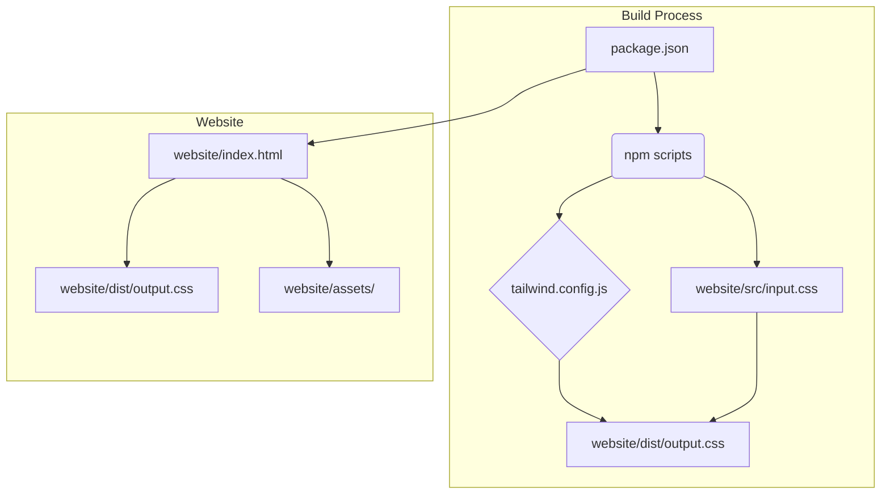

# Product Overview

## Project Name

TinyGnomes Static Website

## Description

A simple static website with animations, built using Tailwind CSS. This is the marketing website for the TinyGnomes service. This project is only about the marketing website, not the TinyGnomes service.

## Goals

Create a simple static website with animations.

## Technologies

*   HTML
*   CSS
*   [Tailwind CSS](../patterns/utility-first-css.md)
*   npm

## Fonts

*   Inter
*   Raleway
*   Fragment Mono
*   Rancho

## Key Files

*   package.json
*   tailwind.config.js
*   website/index.html
*   website/src/input.css
*   website/dist/output.css
*   website/assets/   [All the website assets]

## File Dependencies

## Features

*   Simple and clean design
*   Responsive layout for various devices
*   [Hero section with two-column layout](../decisions/002-adopt-two-column-hero-layout.md) (heading, button, illustration)
*   Interactive elements with mouse-over animations